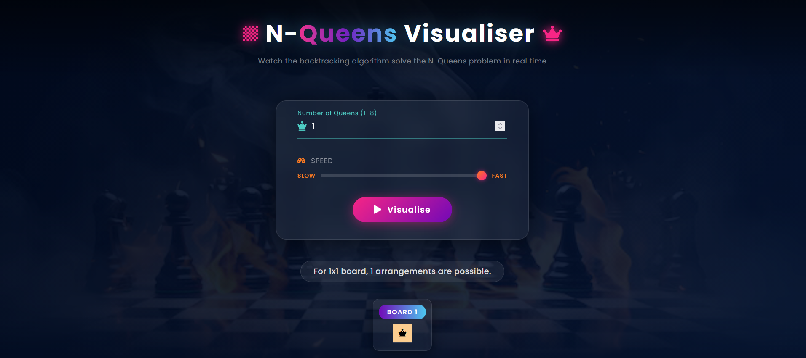

# N-Queen Visualizer

## Overview
This project is a web-based visualization of the N-Queen Problem using the Backtracking Algorithm. It demonstrates how recursive backtracking places queens on an N×N chessboard while ensuring that no two queens attack each other.

## Technologies Used
- HTML
- CSS
- JavaScript

## Features
- Interactive N-Queen visualization
- Adjustable board size
- Recursive backtracking algorithm
- Step-by-step visualization
- Conflict checking using row and diagonal validation

## My Contribution
- Implemented the complete Backtracking Algorithm.
- Developed the recursive solution in `app.js`.
- Implemented the `isValid()` function for conflict detection.
- Integrated the algorithm with the board visualization.

## Team Contribution
The user interface, styling, board layout, and overall visualization were developed by my teammate.

## How to Run
1. Download or clone the repository.
2. Open `index.html` in your browser.
3. Select the board size.
4. Click **Start** to visualize the solution.

## Algorithm
The project uses the Backtracking Algorithm:

1. Place a queen in the current column.
2. Check if the position is safe.
3. If safe, recursively place the next queen.
4. If no valid position exists, backtrack.
5. Continue until all queens are placed.
